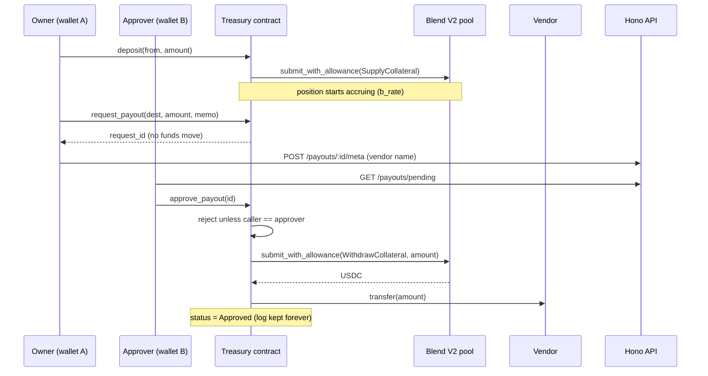

# Spec — Treasury Vault

Status: draft, ready to build. Supersedes the placeholder in `docs/PLAN.md` §1.

## 1. Overview

`stellar-ambassador` becomes a **single-owner on-chain treasury**. A company deposits USDC into
a Soroban contract; the contract immediately supplies it to a Blend V2 lending pool so it earns
yield; paying a vendor requires two distinct parties — the `owner` queues the payout, a separate
`approver` executes it. No payout can move funds without the approver's signature, and the
contract itself enforces that, not an off-chain process.

The chain guarantee a database could not give: the owner of the money cannot unilaterally spend
it, and cannot appoint themselves as the person who authorises spending.

This replaces the `ambassador` placeholder contract entirely (`docs/PROGRESS.md` "Not done" #1
and #2). Wallet-as-identity (D-001), stateless session (D-002), Postgres-holds-no-money (D-003)
and committed bindings (D-004) all stand unchanged — the design leans on them rather than
against them.

Deliberately asymmetric design, settled during grilling: **`set_approver` is approver-only.**
The owner can never rotate the approver. This is what makes the gate real, and it means a lost
approver key freezes the treasury permanently. Accepted, documented, not mitigated.

Assumptions made while writing this spec, flagged because they were not explicitly decided:
pool and USDC addresses are `init` parameters rather than compile-time constants; `memo` is a
`String` capped at 64 chars; the approver "notification" is a poll endpoint, not a push channel.

## 2. Data model

### On-chain (authoritative)

Contract instance storage:

| Key | Type | Meaning |
|-----|------|---------|
| `Owner` | `Address` | May call `deposit` and `request_payout`. Nothing else. |
| `Approver` | `Address` | May call `approve_payout`, `reject_payout`, `set_approver`. |
| `Pool` | `Address` | Blend V2 pool. Set at `init`, immutable. |
| `Usdc` | `Address` | Reserve asset. Set at `init`, immutable. |
| `NextRequestId` | `u32` | Monotonic counter. |

Persistent storage:

| Key | Type | Meaning |
|-----|------|---------|
| `Request(u32)` | `PayoutRequest` | `{ destination, amount, memo, status }` |

`PayoutRequest.status` is `Pending | Approved | Rejected`. Records are never deleted — the
request log *is* the audit trail.

There is **no per-depositor balance map**. One treasury, one pooled Blend position; `balance()`
reads the contract's own position from the pool. Anyone may deposit, but depositing buys no
claim — it is a contribution to the company's treasury, not a share in a vault.

### Off-chain (Postgres, filing cabinet only — D-003)

| Model | Fields | Why it cannot live on-chain |
|-------|--------|------------------------------|
| `PayoutMeta` | `requestId`, `vendorName`, `invoiceRef`, `note`, timestamps | Free text; no contract logic reads it |
| `PositionSnapshot` | `capturedAt`, `positionUsdc` | Time series for the yield chart; the chain only knows *now* |

Neither is ever consulted to decide whether a payout may proceed. Losing the whole database
loses vendor names and a chart, nothing more.

## 3. APIs changed

None. `/auth/*` and `/health` are untouched.

## 4. APIs added

All under the existing `{ success, data }` envelope, Zod schemas in
`packages/shared/src/schemas/`, session cookie required.

| Method | Path | Body | Response |
|--------|------|------|----------|
| `POST` | `/payouts/:requestId/meta` | `{ vendorName, invoiceRef?, note? }` | the stored meta |
| `GET` | `/payouts` | — | on-chain requests joined with their meta |
| `GET` | `/payouts/pending` | — | pending requests only — the approver's inbox |
| `GET` | `/treasury/position` | — | `{ positionUsdc }`, simulated live |
| `GET` | `/treasury/position/history` | — | snapshots for the chart |

Write access to `/payouts/:requestId/meta` is restricted to the session address matching the
on-chain `owner` or `approver`, simulated fresh per request — never read from the JWT (D-002).

## 5. Old vs new flow

**Old:** connect Freighter → sign nonce → session cookie → `bump()` a counter. Proves the
toolchain, nothing else.

**New:** the same auth, then the treasury loop:

1. Anyone calls `deposit(from, amount)` — USDC moves into the contract and is supplied to Blend
   in the same transaction. No idle buffer; every deposited unit starts earning immediately.
2. `balance()` grows on its own as Blend's `b_rate` rises. Nobody has to call anything.
3. Owner calls `request_payout(destination, amount, memo)` → returns a `u32` id, moves no money.
   The web app then attaches the vendor name off-chain.
4. Approver sees it in their inbox, calls `approve_payout(id)` — one transaction withdraws
   exactly `amount` from Blend and transfers it to the destination. Or `reject_payout(id)`.

Funds are checked **only at approve time**, never at request time. Several requests may be
pending at once; if the treasury cannot cover one, `approve_payout` reverts, the request stays
`Pending`, and the approver retries after the next deposit. There is no partial payment — a
partial transfer would be a silent change to what the approver signed off on.

## 6. Third-party APIs used

**Blend V2 on Stellar testnet** — verified live, 2026-08-15:

| What | Address |
|------|---------|
| Pool | `CCEBVDYM32YNYCVNRXQKDFFPISJJCV557CDZEIRBEE4NCV4KHPQ44HGF` |
| USDC reserve | `CAQCFVLOBK5GIULPNZRGATJJMIZL5BSP7X5YJVMGCPTUEPFM4AVSRCJU` |

Used: `submit_with_allowance(from, spender, to, requests)` to supply and withdraw,
`get_positions(address)` to read the position. Yield is genuine — the reserve's `b_rate` was
`1.0559` at time of writing, i.e. 5.6% already accrued. Utilization ~43% against a 95% cap, so
a synchronous withdraw inside `approve_payout` has ample headroom at demo size.

## 7. UI changes

Two new service domains in `packages/web/services/` following the existing four-file pattern
(`*.types.ts`, `*.queries.ts`, `*.service.ts`, `*.hook.ts`): `treasury` and `payouts`.

The demo is a **two-wallet handoff**, and the UI exists to make that legible:

- **Treasury view** — current position in USDC, a yield-over-time chart from the snapshot
  history, and a deposit form. Visible to anyone connected.
- **Owner view** — request a payout: destination, amount, memo, vendor name. The vendor name
  goes to the API; everything else goes on-chain.
- **Approver view** — the pending inbox. Approve or reject, each a signed transaction. Renders
  only when the connected wallet matches the on-chain `approver`.

The judge sees: wallet A deposits and requests, wallet B approves, the vendor's balance moves,
and wallet A could not have done it alone.

## 8. Risks

| Risk | Severity | Handling |
|------|----------|----------|
| **Contract-as-supplier auth to Blend** — the contract is `from`/`spender` and must authorise the nested token transfer as itself (`authorize_as_current_contract` + `InvokerContractAuthEntry`, or `approve` then `submit_with_allowance`). Documented, not yet run here. | **Highest — spike this before anything else** | Standalone spike: deposit 1 USDC, read the position back. Nothing else starts until it passes. |
| **Recipients need a trustline.** The pool's USDC is a classic asset behind a SAC; transfers to an untrusted address fail with `trustline entry is missing for account`. | High — kills a live demo | Prepare and `trust()` the demo vendor address in advance; surface the error explicitly in the UI. |
| **Test USDC is not mintable** — admin-gated to `GATALTGTWIOT6BUDBCZM3Q4OQ4BO2COLOAZ7IYSKPLC2PMSOPPGF5V56`. Acquisition is one live DEX ask (1000 USDC at 1 XLM, no bids). | Medium | Buy early and hold. Fallback: supply friendbot XLM as collateral to the same pool and borrow USDC. |
| **Testnet reset** wipes the Blend deployment and every address above. | Medium | Addresses are `init` params, not constants; re-read `blend-utils/testnet.contracts.json` and redeploy. |
| **Lost approver key bricks the treasury** — funds accrue in Blend, unwithdrawable, forever. | By design | One README line naming it as deliberate, with N-of-M as the v2 fix. |
| **Scope**: contract + UI + API, with no known deadline. The API is the layer that can be cut without touching the demo. | Unknown until the deadline is | Build in the order contract → UI → API. |

## 9. Diagram



## 10. Open questions

1. **Submission deadline.** Unanswered, and it is the input that decides whether all three
   layers are realistic. Contract alone is ~2 days; all three is materially more.
2. **Snapshot cadence** for `PositionSnapshot` — a cron, an on-read write, or a manual button.
   Affects nothing but chart resolution.

---

## Detail

### Contract interface (`contracts/contracts/treasury`)

```rust
fn init(env: Env, owner: Address, approver: Address, pool: Address, usdc: Address)
    -> Result<(), Error>;              // errors OwnerIsApprover if owner == approver
fn deposit(env: Env, from: Address, amount: i128) -> Result<(), Error>;
fn request_payout(env: Env, destination: Address, amount: i128, memo: String)
    -> Result<u32, Error>;             // owner only
fn approve_payout(env: Env, id: u32) -> Result<(), Error>;   // approver only
fn reject_payout(env: Env, id: u32) -> Result<(), Error>;    // approver only
fn set_approver(env: Env, new_approver: Address) -> Result<(), Error>; // approver only
fn balance(env: Env) -> i128;          // contract's Blend position
fn get_request(env: Env, id: u32) -> Result<PayoutRequest, Error>;
fn get_owner(env: Env) -> Result<Address, Error>;
fn get_approver(env: Env) -> Result<Address, Error>;
```

Amounts are `i128` at **7 decimals**, matching the pool's reserve config (`decimals: 7`).

`init` must reject `owner == approver`. Under approver-only rotation this is the *only* moment
separation can ever be established — if the two are equal at init, the owner is both parties
permanently and the entire security claim is void. Likewise `set_approver` must reject a
new approver equal to the current `owner`.

### Errors (append-only — the frontend maps by number, per `docs/CONTRACT_SPEC.md`)

| Variant | Code |
|---------|------|
| `AlreadyInitialized` | 1 |
| `NotInitialized` | 2 |
| `NotAuthorized` | 3 |
| `OwnerIsApprover` | 4 |
| `RequestNotFound` | 5 |
| `RequestNotPending` | 6 |
| `InsufficientFunds` | 7 |
| `InvalidAmount` | 8 |

`InsufficientFunds` is an explicit pre-check against `balance()` inside `approve_payout`, so the
approver gets a legible error instead of an opaque Blend host error.

### Seams and tests

Three seams, all of which already exist — no new architectural interface is introduced:

1. **The contract's public interface** — the only place policy is decided. Unit-tested in
   `contracts/contracts/treasury/src/test.rs` with a mock SEP-41 token and a mock pool, so tests
   need no network. Cases that must exist: `init` rejects `owner == approver`; owner cannot
   `approve_payout`; owner cannot `set_approver`; approver cannot `request_payout`; approving
   above balance reverts and leaves the request `Pending`; approving twice fails on the second;
   rejecting then approving fails.
2. **`make bindings`** — the Rust→TS seam. Generated client is committed (D-004). Add `treasury`
   to `CONTRACTS` in the Makefile; the `deploy` target's hardcoded `init --admin $(SOURCE)` needs
   the new four-argument signature.
3. **`packages/api/src/lib/soroban.ts`** — the read/signing client the API already uses for
   simulation. New endpoints go through it; no new HTTP client.

An integration test against live testnet Blend is explicitly *not* attempted in CI — the
contract-level tests use a mock pool, and the Blend interaction is proven by the spike and the
demo.

### Migration from the placeholder

`ambassador` is deleted, not extended. `docs/CONTRACT_SPEC.md` is rewritten against the table
above; `docs/PLAN.md` §1 and §4 are filled in; `docs/API_SPEC.md` §3 gains the payout and
treasury domains. `docs/DECISIONS.md` gains rows for approver-only rotation and for the
no-recovery stance, each with its reason.
