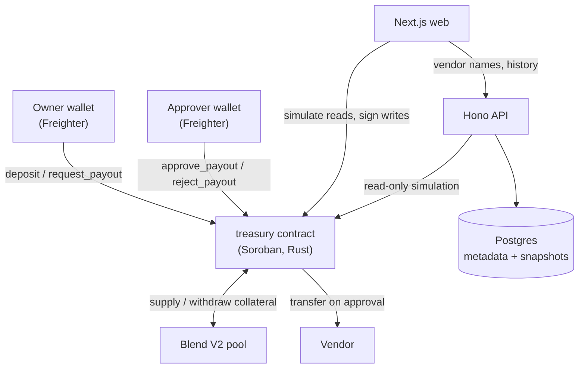

<h1 align="center">StashCo</h1>

<h3 align="center">An on-chain treasury that its own owner cannot drain.</h3>

<p align="center">
  A single-owner treasury on Stellar Soroban. USDC is supplied to a Blend V2 lending pool so it<br />
  earns yield, and every payout is gated behind a second, separate approver — enforced by the<br />
  contract itself, not by an off-chain process.
</p>

<p align="center">
  <a href="https://stellar.org"></a>
  <a href="https://developers.stellar.org/docs/build/smart-contracts"></a>
  <a href="https://www.blend.capital/"></a>
  <a href="https://nextjs.org/"></a>
  <a href="https://github.com/yoms07/stashco/actions"></a>
  <a href="https://developers.stellar.org/docs/networks"></a>
</p>

<p align="center">
  <a href="#submission-checklist">Checklist</a> ·
  <a href="#live-demo">Live Demo</a> ·
  <a href="#on-chain-verification">On-Chain Proof</a> ·
  <a href="#screenshots">Screenshots</a> ·
  <a href="#getting-started">Getting Started</a> ·
  <a href="#smart-contract">Smart Contract</a> ·
  <a href="#cicd">CI/CD</a> ·
  <a href="#test-results">Tests</a>
</p>

<p align="center">
  <strong>Repository:</strong> <a href="https://github.com/yoms07/stashco">yoms07/stashco</a><br />
  <strong>Contract:</strong> <code>CBHMF3HL4XA5XCVIEGPLBPNDIMEUP5YFHFSJAE6G6545M5HWWT5OP6R7</code>
</p>

---

## Submission Checklist

| Requirement | Status | Details |
| --- | --- | --- |
| Public GitHub repository | ⏳ | Repo is currently **private** — flip to public before submitting |
| Complete README documentation | ✅ | This document |
| 10+ meaningful commits | ✅ | 14 commits — `git log --oneline` |
| Live demo link | ⏳ | [Placeholder — deploy and update](#live-demo) |
| Contract deployment address | ✅ | `CBHMF3HL4XA5XCVIEGPLBPNDIMEUP5YFHFSJAE6G6545M5HWWT5OP6R7` |
| Transaction hash for contract interaction | ✅ | Six real testnet hashes — [On-Chain Verification](#on-chain-verification) |
| Mobile responsive UI screenshot | ⏳ | Add `docs/mobile.png` |
| CI/CD pipeline screenshot | ⏳ | Add `docs/ci.png` — workflow is committed and runs on push |
| Test output (3+ passing tests) | ✅ | **56 passing** (17 contract + 39 API) — [Test Results](#test-results) |

---

## Live Demo

> **Placeholder:** replace with the deployed frontend URL.

**Demo URL:** `https://your-demo-url.vercel.app`

**Network:** Stellar Testnet · **Wallet:** [Freighter](https://www.freighter.app/), set to Testnet

To exercise the two-wallet flow a visitor needs both the owner and approver keys, so the demo is
best shown live. See [Running the demo](#running-the-two-wallet-demo).

---

## What makes this different

Most "treasury" demos are a balance and a withdraw button. The guarantee here is one a database
cannot give:

> **The owner of the money cannot spend it alone, and cannot appoint themselves as the person who
> authorises spending.**

Three deliberate asymmetries make that true rather than decorative:

- **`set_approver` is approver-only.** The owner can never rotate the approver.
- **`init` rejects `owner == approver`.** Under approver-only rotation, that is the *only* moment
  separation can ever be established — allow it once and the claim is void forever.
- **There is no recovery path.** A lost approver key freezes the treasury permanently. An escape
  hatch would by definition be a way to move funds without approval — the exact thing being
  prevented. Accepted and documented, not mitigated. N-of-M approvers is the v2 fix.

Meanwhile the idle money is not idle: every deposit is supplied to Blend V2 in the same
transaction, so the treasury earns yield while it waits.

---

## On-Chain Verification

### Deployment

| Field | Value |
| --- | --- |
| **Network** | Stellar Soroban Testnet |
| **Contract ID** | [`CBHMF3HL4XA5XCVIEGPLBPNDIMEUP5YFHFSJAE6G6545M5HWWT5OP6R7`](https://stellar.expert/explorer/testnet/contract/CBHMF3HL4XA5XCVIEGPLBPNDIMEUP5YFHFSJAE6G6545M5HWWT5OP6R7) |
| **Owner** | `GBW65PM5E3O3TVV4JMBVSJI7NDOFLHH3MNJJDLRARXRZ562HE3ZLOXQV` |
| **Approver** | `GD3MA2JB42SY4O5NQK4CNQK7PMTRUTCNR26URLRQVPXYKBSVX4TZXDF3` |
| **Blend V2 pool** | `CCEBVDYM32YNYCVNRXQKDFFPISJJCV557CDZEIRBEE4NCV4KHPQ44HGF` |
| **USDC (reserve 3)** | `CAQCFVLOBK5GIULPNZRGATJJMIZL5BSP7X5YJVMGCPTUEPFM4AVSRCJU` |
| **RPC** | `https://soroban-testnet.stellar.org` |

### Transaction hashes

| # | Action | Hash |
| --- | --- | --- |
| 1 | Deploy | [`fd7346c0…b553d211`](https://stellar.expert/explorer/testnet/tx/fd7346c07abfe6d719993cc3aea97c151db80ca8743bff155ceb95f1b553d211) |
| 2 | `init(owner, approver, pool, usdc)` | [`e35fd25c…9a4d46ea`](https://stellar.expert/explorer/testnet/tx/e35fd25c5ad02b1ba1eb6161d2abbf862c15312750b66c11af0ad5499a4d46ea) |
| 3 | `deposit` — 400 USDC into Blend | [`36f83f43…0925eb6a`](https://stellar.expert/explorer/testnet/tx/36f83f4364ca536267f80ad33a7bcd5171751dd9f0213224579be4e60925eb6a) |
| 4 | `request_payout` — owner queues 5 USDC | [`d2062788…d8c28bb6`](https://stellar.expert/explorer/testnet/tx/d20627885f66a851c729769657b0a7404e98795bbefc7c65ecd5e319d8c28bb6) |
| 5 | `approve_payout` — **approver** releases it | [`b5f25275…c89b4fd7`](https://stellar.expert/explorer/testnet/tx/b5f25275c7f7c2200d888ec39ef5ad52ff24d1425c54d8fb932e1898c89b4fd7) |
| 6 | Blend supply/withdraw auth spike | [`25eb62e9…7194159f`](https://stellar.expert/explorer/testnet/tx/25eb62e92cb9f0af4e0594187b3fa01fe8a118c850e70cb5e4862e617194159f) |

### The security claim, executed on-chain

Not merely unit-tested — run against the deployed contract:

```text
1. Owner queues payout 0                    -> request id 0, no funds move
2. Owner attempts approve_payout(0)         -> REJECTED
     "Missing signing key for account GD3MA2JB…"   (the approver's)
     request survives as Pending, not consumed
3. Approver calls approve_payout(0)         -> vendor 0 -> 5.0000000 USDC
4. Treasury position                        -> 4000000064 -> 3950000043
```

Step 2 is the entire product.

### Yield is real, and observable

The position climbs with nobody calling anything, as Blend's `b_rate` rises:

```text
3999999999  ->  4000000022  ->  4000000063  ->  4000000139
```

Those deltas live in the 7th decimal place, which is why every layer — contract, API, Postgres,
JSON, UI — keeps amounts as strings. A single `Number()` anywhere in that path flattens the yield
chart to a straight line.

---

## Screenshots

### Desktop UI

> **Placeholder:** add `docs/web.png`


### Mobile responsive UI

> **Placeholder:** add `docs/mobile.png`


### CI/CD pipeline

> **Placeholder:** capture a successful Actions run and save as `docs/ci.png`


### Test output

> **Placeholder:** add `docs/test.png`

```text
running 17 tests
test test::init_rejects_owner_equal_to_approver ... ok
test test::owner_cannot_approve_payout ... ok
test test::owner_cannot_set_approver ... ok
test test::approver_cannot_request_payout ... ok
test test::set_approver_rejects_the_owner ... ok
test test::approving_above_balance_reverts_and_leaves_request_pending ... ok
test test::approving_twice_fails ... ok
test test::rejecting_then_approving_fails ... ok
test test::balance_is_underlying_not_btokens ... ok
test test::balance_grows_as_b_rate_rises ... ok
...
test result: ok. 17 passed; 0 failed; 0 ignored

 Test Files  8 passed (8)
      Tests  39 passed (39)
```

---

## Architecture



The chain is authoritative for anything that touches money. Postgres holds vendor names and a
chart series and is never consulted to decide whether a payout may proceed — losing it entirely
costs a few labels and a graph.

---

## Tech Stack

| Layer | Technology |
| --- | --- |
| Smart contract | Rust, `soroban-sdk` 26, Stellar CLI 27 |
| Yield | Blend V2 lending pool (USDC reserve) |
| Contract bindings | `stellar contract bindings typescript`, committed to `dist/` |
| Backend | Hono, Zod, Prisma, `jose` session JWTs |
| Frontend | Next.js 15 App Router, TanStack Query, Tailwind, shadcn/ui, Freighter |
| CI | GitHub Actions (`.github/workflows/ci.yml`) |
| Tooling | pnpm workspaces + Cargo workspace, seamed by a Makefile |

---

## Smart Contract

`contracts/contracts/treasury` — see `docs/CONTRACT_SPEC.md` for the frozen interface.

### Interface

| Function | Auth | Notes |
| --- | --- | --- |
| `init(owner, approver, pool, usdc)` | once | `OwnerIsApprover` if `owner == approver` |
| `deposit(from, amount)` | `from` | Anyone may deposit; supplied to Blend in the same tx |
| `request_payout(destination, amount, memo)` | owner only | Returns a `u32` id; moves no money |
| `approve_payout(id)` | **approver only** | Withdraws from Blend and pays the destination |
| `reject_payout(id)` | **approver only** | Marks rejected; the record is kept forever |
| `set_approver(new_approver)` | **approver only** | Rejects the owner |
| `balance()` | view | Blend position converted from bTokens to underlying USDC |
| `get_request(id)` / `get_owner()` / `get_approver()` / `next_request_id()` | view | |

Amounts are `i128` at 7 decimals. `memo` is capped at 64 characters.

### Errors

Append-only — the frontend maps by number.

| Code | Variant | Code | Variant |
| --- | --- | --- | --- |
| 1 | `AlreadyInitialized` | 5 | `RequestNotFound` |
| 2 | `NotInitialized` | 6 | `RequestNotPending` |
| 3 | `NotAuthorized` | 7 | `InsufficientFunds` |
| 4 | `OwnerIsApprover` | 8 | `InvalidAmount` |

### Two Blend behaviours worth knowing

Both were established by a testnet spike before the contract was written, and both would have
shipped as bugs otherwise:

1. **Positions are denominated in bTokens, not underlying.** They appreciate against USDC as
   `b_rate` rises — that appreciation *is* the yield. `balance()` converts with
   `bTokens * b_rate / 1e12`. Note `1e12`, not the reserve's `scalar` field of `1e7`. Returning
   the raw position would understate the treasury by the accrued yield and make the
   `InsufficientFunds` pre-check compare bTokens against underlying.
2. **The bToken round trip floors.** Withdrawing `100000000` returns `99999999`, so "withdraw
   exactly `amount`" is not achievable. `approve_payout` withdraws with a small buffer, verifies
   the realised delta covers the amount, then transfers *exactly* the amount — never partially,
   because a partial transfer silently changes what the approver signed off on.

---

## API

| Method | Path | Purpose |
| --- | --- | --- |
| `POST` | `/auth/challenge` · `/auth/verify` · `/auth/logout` | Wallet-as-identity session |
| `GET` | `/treasury/position` | Live position, simulated per request, never cached |
| `GET` | `/treasury/position/history` | Snapshots for the yield chart |
| `POST` | `/payouts/:requestId/meta` | Vendor name / invoice ref (owner or approver only) |
| `GET` | `/payouts` · `/payouts/pending` | Chain state left-joined with metadata |

Owner and approver are simulated fresh from the contract on every request and never read from the
session token — `set_approver` is callable, so a role cached in a JWT is a live authorization
bypass the moment it fires.

---

## Getting Started

### Prerequisites

- Node.js 22+, pnpm 10+
- Rust + `wasm32v1-none`, [Stellar CLI](https://developers.stellar.org/docs/tools/cli/install-cli) 27+
- PostgreSQL (or Docker)
- [Freighter](https://www.freighter.app/), set to **Testnet**

### Setup

```bash
git clone https://github.com/yoms07/stashco.git
cd stashco
pnpm install

cp packages/api/.env.example packages/api/.env
cp packages/web/.env.example packages/web/.env.local

# Postgres (or point DATABASE_URL at your own)
docker run -d --name sa-postgres \
  -e POSTGRES_USER=user -e POSTGRES_PASSWORD=password \
  -e POSTGRES_DB=stellar_ambassador -p 5432:5432 postgres:16-alpine

pnpm --filter @stashco/api prisma:migrate
```

### Run

```bash
pnpm dev     # web on :3000, api on :3001
```

### Contracts

```bash
make setup      # wasm target + funded testnet identity
make test       # cargo unit tests
make build      # compile to wasm
make bindings   # regenerate the TypeScript client
make deploy     # deploy + init
```

### Running the two-wallet demo

The point of the demo is that the same app grants different powers to different wallets. Import
**both** identities into Freighter:

```bash
stellar keys secret deployer   # the OWNER
stellar keys secret approver   # the APPROVER
```

| Connected wallet | What renders |
| --- | --- |
| Owner | Position, deposit form, **request payout** form |
| Approver | Position, deposit form, **pending inbox with approve/reject** |
| Anyone else | Position and deposit only |

Queue a payout as the owner, note there is no control anywhere to advance it, then switch to the
approver and release it. That dead end is the product working.

---

## CI/CD

`.github/workflows/ci.yml` runs on every push and pull request to `main`:

| Job | Steps |
| --- | --- |
| **contracts** | Rust toolchain + `wasm32v1-none`, cached, `cargo test --workspace` |
| **node** | pnpm install, `prisma generate`, `pnpm -r typecheck`, API tests, `pnpm -r build` |

---

## Test Results

**56 passing** — 17 contract, 39 API.

The contract tests guard the policy, which is where a subtle mistake voids the security claim:

| Test | Guards |
| --- | --- |
| `init_rejects_owner_equal_to_approver` | The one moment separation can be established |
| `owner_cannot_approve_payout` | The owner cannot spend alone |
| `owner_cannot_set_approver` | The owner cannot appoint themselves |
| `approver_cannot_request_payout` | The roles are separate in both directions |
| `set_approver_rejects_the_owner` | Rotation cannot collapse the roles later |
| `approving_above_balance_reverts_and_leaves_request_pending` | A failed approval is retryable, not destructive |
| `approving_twice_fails` / `rejecting_then_approving_fails` | A request settles exactly once |
| `balance_is_underlying_not_btokens` | The bToken conversion |

The three authorization tests assert `Error(Auth, InvalidAction)` specifically rather than a bare
`should_panic`, which would pass if the test panicked for any unrelated reason.

```bash
cd contracts && cargo test          # 17
pnpm --filter @stashco/api test     # 39
```

The Blend pool is mocked in unit tests — with the live `b_rate` and its flooring behaviour, so
bTokens-vs-underlying confusion fails loudly. The real Blend interaction is proven on testnet
instead, by the spike and by the deposit above.

---

## Known Limitations

Stated plainly rather than hidden:

- **A lost approver key freezes the treasury permanently.** By design — see above. N-of-M is v2.
- **No wallet has signed the UI end to end.** Every screen is typechecked, built, and reads live
  contract state, but Freighter cannot be driven headlessly, so the signed deposit / request /
  approve paths were verified by simulation rather than by a real signature.
- **The generated bindings return empty error messages.** `errorTypes` is built from the Rust
  enum's doc comments, which the treasury has none of, so `unwrapErr().message` is always `""`.
  The frontend reads error codes from the raw simulation diagnostics instead. The fix is doc
  comments on the enum, deferred because it changes the wasm and redeploying would reset the
  position and restart the yield clock.
- **Yield-chart history is sparse.** Snapshot capture is hourly and started the day the contract
  was deployed.
- **`pnpm lint` does not run** — the repo has no ESLint config, so `next lint` drops into an
  interactive prompt. `next build` still typechecks.
- Testnet USDC could not be bought: the DEX order the spec relied on did not exist. The balance
  was obtained by supplying XLM as collateral to the same Blend pool and borrowing against it.

---

## Documentation

| Document | Contents |
| --- | --- |
| `docs/PLAN.md` | What it is and why |
| `docs/CONTRACT_SPEC.md` | Frozen contract interface |
| `docs/API_SPEC.md` | Endpoint shapes |
| `docs/DECISIONS.md` | Settled decisions, each with its reason |
| `docs/PROGRESS.md` | What exists and what is next |
| `docs/DESIGN.md` | Design tokens |

---

## License

Apache-2.0 (Stellar ecosystem standard)

---

<p align="center"><strong>StashCo</strong> — the owner holds the money, and still cannot move it alone.</p>
